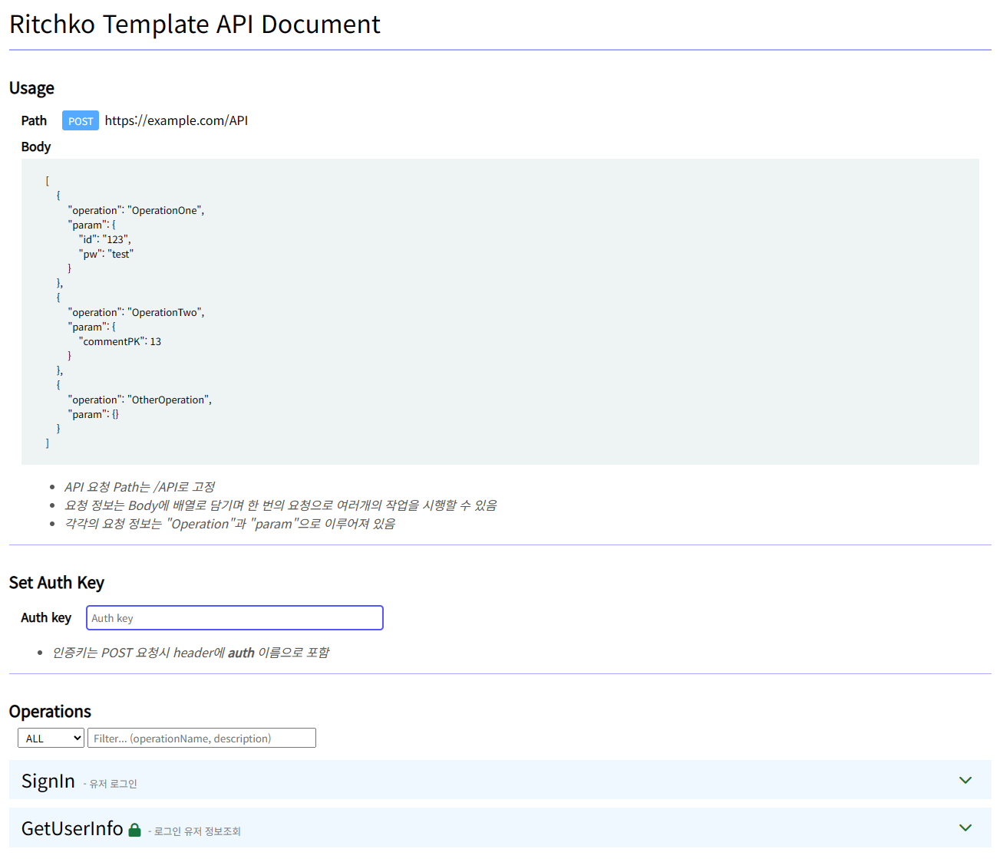

# Ritchko-template
리치코에서 웹 서비스를 만드는데 기반이되는 모든 요소들을 모아서 만든 **node.js 기반** 템플릿 레포  
xeon-lloyd가 코딩을 처음 시작할 때부터 필요한 기능들을 모으고 정리하고 하면서 만들어진 사설(?) 프레임워크  
 
새로운 아이디어가 떠오르면 빠르게 구현(Quick Start), 코드의 통일을 위함을 목적  
소규모 프로젝트를 고려하여 만든 템플릿으로 배포 혹은 관리를 용의하게 하기위해서 모노레포로 제작  

 - 프론트 *(순수 html, css, js)*
 - 백엔드(API) *(순수 js+express)*
 - 배포 *(github action)*
 - 실행 *(pm2)*

위 요소를 포함하고 있으며 목적에 따라서 **불필요한 부분을 삭제하고 사용**가능  
*ex) 백엔드 API 서비스만 필요하다면 프론트와 정적 파일 serve 기능 제거*  
 

## 프론트 템플릿

헤더, 메뉴, 사이드바, 푸터등 기본 구성요소를 포함  
모바일 반응형
- [프론트 설명서](readme/front-main.md)   
 

## API 문서(백엔드)

API 사용 방식과 각종 API 리스트를 보여주는 API 문서 제공 기능  
 

operation명과 필요한 파라메터 구조, 응답 종류와 구조 기술  
param값을 임의로 수정해서 바로 **test Request도 가능**  
- [백엔드 설명서](readme/backend-main.md)   
 

## 실행
**pm2**를 이용해서 **ecosystem.config.js**로 작성된대로 어플리케이션(서버)를 실행  
- [실행 설명서](readme/run-main.md)   
 

## 배포
**github actions**를 이용해서 **workflows**로 작성하여 지정한 서버로 배포 *(여러대의 서버에 배포하도록 작성도 가능)*  
- [배포 설명서](readme/deploy-main.md)   
 

## why?
사실 이미 많은 회사와 많은 사람이 사용하고 있는 프레임워크와 라이브러리가 많지만  
수 년간 이것만 사용하다 보니까 **익숙해져 버림** + 항상 프로젝트는 MVP 구현을 위해 빨리빨리 만들다 보니까 익숙하면서 빠른 것을 찾으니 잠금효과 발생 *(다른 프레임워크로 넘어가기 점점 어려워짐)*  
지금까지 혼자 프로젝트를 해와서 상관이 없었지만 **내 코드를 다른 사람에게 소개하자니 무엇을 사용했는지 전혀 알릴 방법이 없어**서 정리하여 public 배포